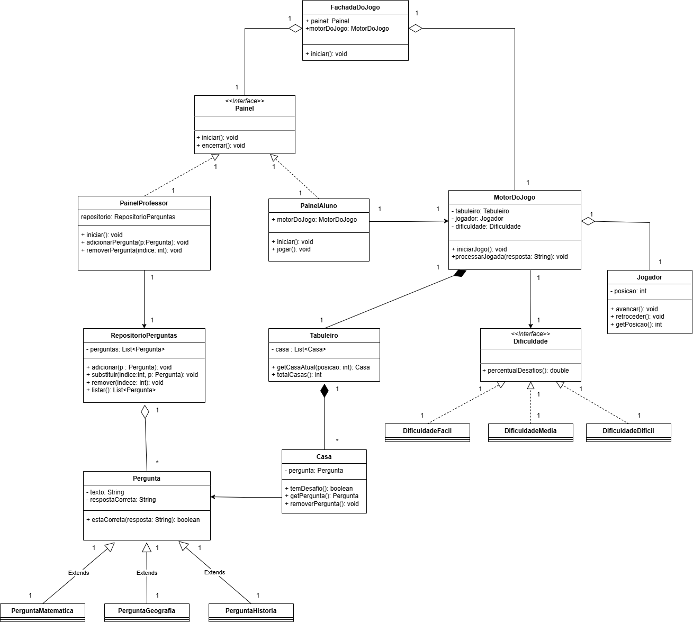

# 📊 Diagrama de Classes – Trilha do Saber

Este documento explica o **Diagrama de Classes** do jogo **Trilha do Saber**, detalhando as responsabilidades de cada classe, suas relações e o motivo das decisões de modelagem.

---

## 🖼️ Diagrama de Classes

> O diagrama completo pode ser visualizado na imagem abaixo:

---

## 🧱 Visão Geral da Arquitetura

O sistema foi modelado seguindo os princípios de:
- Alta coesão
- Baixo acoplamento
- Separação clara de responsabilidades

As classes estão organizadas em grupos conceituais:
- Fachada e painéis
- Motor do jogo
- Domínio (tabuleiro, jogador, perguntas)
- Repositórios
- Estratégias de dificuldade

---

## 🎛️ Fachada e Painéis

### `FachadaDoJogo`
Responsável por coordenar o fluxo geral da aplicação.

Funções:
- Inicializar o sistema
- Delegar o controle para o painel ativo

---

### `Painel` (Interface)
Define o contrato comum para todos os painéis do sistema.

Métodos:
- `iniciar()`
- `encerrar()`

---

### `PainelAluno`
Implementa a interface `Painel`.

Responsabilidades:
- Iniciar o jogo
- Controlar a interação do aluno com o motor do jogo
- Executar a lógica de jogo (jogar)

---

### `PainelProfessor`
Implementa a interface `Painel`.

Responsabilidades:
- Gerenciar o repositório de perguntas
- Adicionar, remover e listar perguntas

---

## ⚙️ Motor do Jogo

### `MotorDoJogo`
Centraliza as regras do jogo.

Responsabilidades:
- Controlar o tabuleiro
- Gerenciar o jogador
- Aplicar a dificuldade
- Processar respostas e jogadas

---

## 🧩 Tabuleiro e Casas

### `Tabuleiro`
Representa a trilha do jogo.

- Contém uma lista de `Casa`
- Controla o acesso às casas do percurso

### `Casa`
Representa uma posição do tabuleiro.

- Pode conter ou não uma pergunta
- Sabe informar se possui desafio

---

## 🧑 Jogador

### `Jogador`
Representa o jogador no jogo.

Responsabilidades:
- Controlar a posição atual
- Avançar ou retroceder conforme regras do jogo

---

## ❓ Perguntas

### `Pergunta` (Classe Abstrata)
Representa o conceito base de uma pergunta.

Motivo de ser abstrata:
- Compartilha atributos comuns (texto, resposta correta)
- Compartilha comportamento (`estaCorreta`)
- Permite especializações sem duplicação de código

---

### Especializações de Pergunta
- `PerguntaMatematica`
- `PerguntaGeografia`
- `PerguntaHistoria`

Essas classes permitem:
- Organização semântica
- Extensão futura com regras específicas

---

## 🗂️ Repositório de Perguntas

### `RepositorioPerguntas`
Responsável por armazenar e gerenciar as perguntas.

Funções:
- Adicionar perguntas
- Remover perguntas
- Substituir perguntas
- Listar perguntas disponíveis

A relação com `Pergunta` é de **agregação**, pois as perguntas podem existir independentemente do repositório.

---

## 🎯 Dificuldade

### `Dificuldade` (Interface)
Define o contrato para cálculo de percentual de desafios no tabuleiro.

Implementações:
- `DificuldadeFacil`
- `DificuldadeMedia`
- `DificuldadeDificil`

Essa abordagem aplica o **padrão Strategy**, permitindo alterar a dificuldade sem modificar o motor do jogo.

---

## ✅ Conclusão

O diagrama de classes do **Trilha do Saber** foi projetado para:
- Ser fácil de entender
- Ser fácil de manter
- Permitir evolução sem quebra de código existente

Ele reflete fielmente a arquitetura e as regras do jogo, servindo como base sólida para implementação e futuras expansões.
